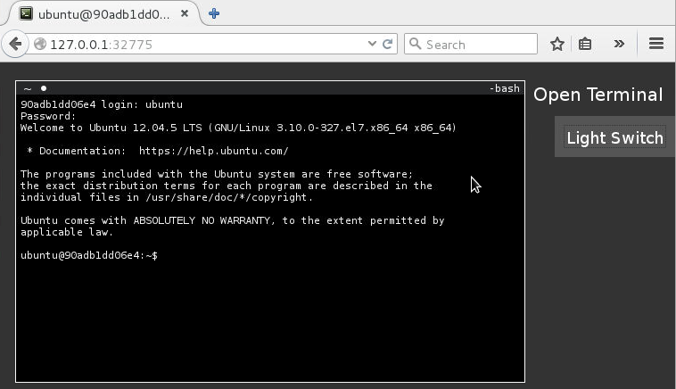

run ttyjs in docker container
=============================

# Build
```
$ git clone https://github.com/Jimmy-Xu/docker-ttyjs.git
$ cd docker-ttyjs
$ ./build.sh
```

# Run
```
$ ./run.sh
http://127.0.0.1:32775
User: ubuntu Pass: M2Y0YT
```




# Debug
```
$ ./debug.sh
root@2729e0b710dd:/# cd tty.js/
root@2729e0b710dd:/tty.js# node tty-me.js
[tty.js] Listening on port 3000.
```
